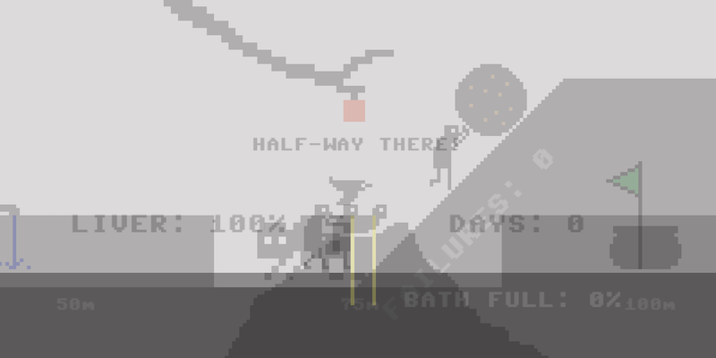

# *Let's Play: Ancient Greek Punishment: Five-in-One*

# [Play Online](https://www.pippinbarr.com/lets-play-ancient-greek-punishment-five-in-one) (desktop and mobile)

## Description
*It's pushing! It's running! It's reaching! It's suffering! It's five ancient greek punishments for the effort of one! It's everything!*

_Let's Play: Ancient Greek Punishment: Five-in-One_ is yet another new edition in the _Let's Play: Ancient Greek Punishment_ series, focusing on a retelling of five (kind of) mythological punishments. In _Five in One_ you live the excitement of all five punishments at the same time.

## Press
Read the [Press kit](../press) for press information

## Documentation
* Read the [Process documentation](../process) for a process journal
* Read the [Commit History](https://github.com/pippinbarr/lets-play-ancient-greek-punishment-five-in-one/commits/master) for step-by-step information about how the project was built
* Look at the [Code Repository](https://github.com/pippinbarr/lets-play-ancient-greek-punishment-five-in-one) for source code etc.

## License
_Let's Play: Ancient Greek Punishment: Five in One_ is an open source game licensed under a [Creative Commons Attribution-NonCommercial 3.0 Unported License](http://creativecommons.org/licenses/by-nc/3.0/). You can obtain the source code from its [code repository](https://github.com/pippinbarr/lets-play-ancient-greek-punishment-five-in-one) on GitHub.
