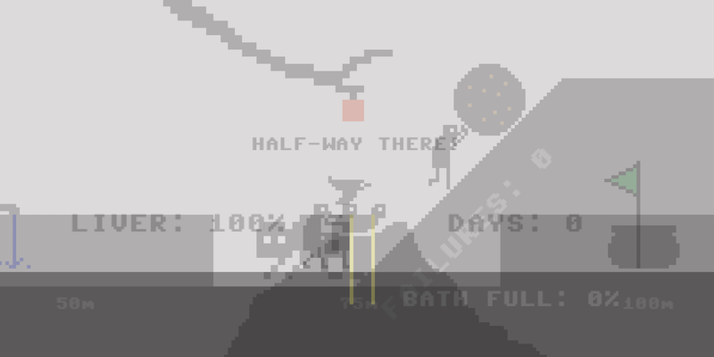

# _Let's Play: Ancient Greek Punishment: Five-in-One_ Press Kit

_It's pushing! It's running! It's reaching! It's suffering! It's five ancient greek punishments for the effort of one! It's everything!_

#### [Play _Let's Play: Ancient Greek Punishment: Five-in-One_](https://pippinbarr.github.io/lets-play-ancient-greek-punishment-five-in-one)

## The basics

* Developer: [Pippin Barr](http://www.pippinbarr.com/)
* Release: 21 August 2019
* Platform: Browser (desktop and mobile)
* Code repository: https://github.com/pippinbarr/lets-play-ancient-greek-punishment-five-in-one
* Price: $0.00

## Who is this Pippin Barr guy?

Pippin is an experimental game developer who has made games about everything from [Eurovision](http://www.pippinbarr.com/2012/03/27/epic-sax-game/) to [performance art](http://www.pippinbarr.com/2011/09/14/the-artist-is-present/) to [dystopian post-work futures](http://www.pippinbarr.com/games/2017/07/03/it-is-as-if-you-were-doing-work.html). He's an Assistant Professor in the [Department of Design and Computation Arts](http://www.concordia.ca/finearts/design.html) at [Concordia University](http://www.concordia.ca/) in Montréal. He is also the associate director of the [Technoculture, Art, and Games (TAG)](http://tag.hexagram.ca/) Research Centre, which is part of the [Milieux Institute for Arts, Culture, and Technology](http://milieux.concordia.ca/).

## Description

_Let's Play: Ancient Greek Punishment: Five-in-One_ is the eleventh edition in the _Let's Play: Ancient Greek Punishment_ series begun in 2011 and comprising: [Let's Play: Ancient Greek Punishment](http://www.pippinbarr.com/games/letsplayancientgreekpunishment/LetsPlayAncientGreekPunishment.html) (2011), [Art Edition Edition](http://www.pippinbarr.com/games/letsplayletsplayancientgreekpunishmentarteditionedition/) (2015), [Limited Edition](http://www.pippinbarr.com/games/letsplayancientgreekpunishmentlimitededition/) (2016), [CPU Edition](http://pippinbarr.github.io/letsplayancientgreekpunishmentcpuedition/) (2017), [Inversion Edition](https://pippinbarr.github.io/lets-play-ancient-greek-punishment-inversion-edition) (2019), [UI Edition](https://pippinbarr.github.io/lets-play-ancient-greek-punishment-ui-edition) (2019), [Teaches Typing](https://pippinbarr.github.io/lets-play-ancient-greek-punishment-teaches-typing) (2019), [Chess Edition](https://pippinbarr.github.io/lets-play-ancient-greek-punishment-chess-edition) (2019), [The Twine](https://pippinbarr.github.io/lets-play-ancient-greek-punishment-the twine) (2019), and the [Bitsy Demake](https://pippinbarr.github.io/lets-play-ancient-greek-punishment-bitsy-demake/) (2019). In _Five-in-One_ the punishments are presented all at once on the same screen, allowing the player to experience five times the torment for the price of one!

## History

_Five-in-One_ is part of my ongoing idea of essentially spending 2019 making variations on the base _Ancient Greek Punishment_ set of minigames as a way to remain "productive" while in transition to a life with a new baby. In fact, I've ended up making a few other games this year as well, but the punishment series has been my chief focus.

In this case, I wanted to explore the extremely simple concept of making all the games playable simultaneously. I've been interested in this sort of "multi-input" experience for a while, but hadn't had a vehicle to explore it with previously - the punishment games make a nice foil. As such, it's a pretty uninteresting technical project - it just slaps all five scenes into one and uses transparency to make every sprite visible at the same time. The actual experience of playing, though, is quite interesting I think, there's a since of the collected punishments forming a kind of "machine" that you're driving forward with your input. The movements of the characters seem like pistons performing endless work. As such, I feel like this particular game fits well with my instinct that it's important to actually _make_ these sorts of conceptual games rather than just to hypothesise them and assume you know what the meaning or outcome would be. I think the experience of this game is more than just the core concept of "all at once", there's a gestalt effect I'm glad I didn't miss.

_Let's Play: Ancient Greek Punishment: Five-in-One_ is also another reference point in the ultra-detailed process documentation approach called [MDMA](http://www.gamesasresearch.com/mdma). In this case, because the game is so simple, there's less documentation that I usually produce. Nonetheless, you can read a little about the game's development by reading its [process documentation](https://github.com/pippinbarr/lets-play-ancient-greek-punishment-five-in-one/blob/master/process/README.md) or by going through its [commit history](https://github.com/pippinbarr/lets-play-ancient-greek-punishment-five-in-one/commits/master).

## Technology

_Let's Play: Ancient Greek Punishment: Five-in-One_ was created using [Phaser 3](https://phaser.io), my favourite 2D games library for JavaScript.

## License

_Let's Play: Ancient Greek Punishment: Five-in-One_ is an open source game licensed under a [Creative Commons Attribution-NonCommercial 3.0 Unported License](http://creativecommons.org/licenses/by-nc/3.0/). You can obtain the source code from its [code repository](https://github.com/pippinbarr/lets-play-ancient-greek-punishment-five-in-one) on GitHub.

## Features

- Everything at once!
- An alpha value of 0.2 for all sprites!
- A tasteful grey background!
- Beeping sounds!
- Five times the punishment!

### Trailer

Honestly it's probably faster to just play actual game.

## Images

  
_It's everything._

## Press

- Coming soon?

## Additional Links

- [Process documentation of _Let's Play: Ancient Greek Punishment: Five-in-One](https://github.com/pippinbarr/lets-play-ancient-greek-punishment-five-in-one/blob/master/process/README.md)
- [Commit history of _Let's Play: Ancient Greek Punishment: Five-in-One](https://github.com/pippinbarr/lets-play-ancient-greek-punishment-five-in-one/commits/master)

## Credits

* Pippin Barr: basically everything?

## Contact

* Email: [pippin.barr+press@gmail.com](mailto:pippin.barr+press@gmail.com)
* Website: [www.pippinbarr.com](http://www.pippinbarr.com/)
* Twitter: [@pippinbarr](https://www.twitter.com/pippinbarr)
* Instagram: [@pippinbarr](https://www.instagram.com/pippinbarr)
* Facebook: [Pippin Barr](http://www.facebook.com/pippin.barr)
